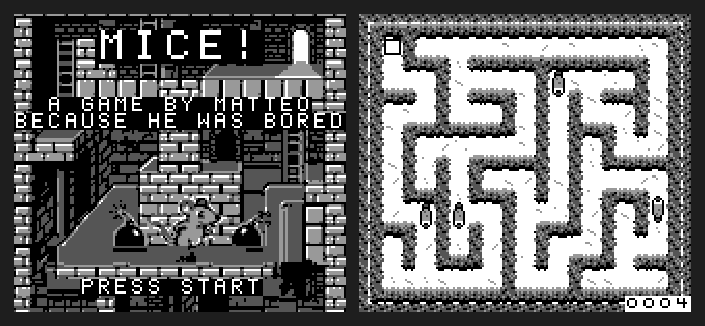

# 🐀 MICE!

Un gioco completo per **Game Boy DMG (1989)**, scritto interamente in C tramite la toolchain [GBDK-2020](https://github.com/gbdk-2020/gbdk-2020). Nato come esperimento di generazione procedurale, si è evoluto in un gioco completo con AI, musica chiptune custom, effetti sonori, schermate di titolo, vittoria e game over.



---

## Gameplay

Sei un cacciatore di topi. Il labirinto viene generato proceduralmente ad ogni partita. I topi si muovono autonomamente nei corridoi, si riproducono e ti travolgono se non li elimini in tempo.

### Controlli

| Tasto | Funzione |
|-------|----------|
| **D-Pad** | Muove il cursore di mira nel labirinto |
| **A** | Sgancia una **bomba** (esplosione a croce, filo intero corridoio) |
| **B** | Sparo secco con il **fucile a pompa** (cooldown 3 secondi) |
| **START** | Pausa / Riprendi |
| **SELECT** | Toggle musica ON/OFF |

### Obiettivo

Elimina **tutti i topi** prima che il timer scada o che ne arrivino troppi. Vinci se il contatore topi raggiunge zero; perdi se il tempo è esaurito o vieni sopraffatto.

---

## Struttura del Progetto

```
.
├── src/                  # Codice sorgente completo del gioco
│   ├── main.c            # Entry point, loop principale, hardware init
│   ├── maze.c/h          # Generazione procedurale del labirinto (Recursive Backtracker)
│   ├── rat.c/h           # Logica AI dei topi, pathfinding, sprite, riproduzione
│   ├── cursor.c/h        # Cursore del giocatore, bomba, fucile, input DAS
│   ├── bomb.c/h          # Meccanica bomba: ticking, esplosione a croce propagante
│   ├── music.c/h         # Mini-tracker musicale 4-canali, SFX, Victory/GameOver jingle
│   ├── tiles.c/h         # Tileset grafico principale (muri autotiled, percorsi)
│   ├── rat_bg.c/h        # Sfondo schermata Game Over
│   ├── title_bg.c/h      # Sfondo schermata Titolo
│   ├── victory_bg.c/h    # Sfondo schermata Vittoria (teschio-trofeo)
│   ├── pause_gfx.c/h     # Sprite lettere "P-A-U-S-E"
│   ├── numbers_gfx.c/h   # Sprite cifre 0-9 per il timer HUD
│   ├── mockup_gfx.c/h    # Tileset esteso (autotiling cespugli)
│   └── bomb_gfx.c        # Sprite animati della bomba (3 fasi + esplosione)
├── tests/
│   └── test_pyboy.py     # Test headless: avvia la ROM via PyBoy e salva screenshot
├── prepare_title.py      # Genera title_bg.c/h dal PNG sorgente
├── prepare_bg.py         # Genera rat_bg.c/h (schermata game over)
├── prepare_victory.py    # Genera victory_bg.c/h con overlay testuale
├── test_audio.c          # ROM diagnostica interattiva per tutti i canali audio
├── Makefile              # Build system preconfigurato per GBDK-2020
├── maze.gb               # ROM finale giocabile (32 KB)
└── test_audio.gb         # ROM diagnostica audio
```

---

## Come Compilare

Assicurati di avere la toolchain **GBDK-2020** installata in `~/.local/gbdk`:

```bash
make
```

Questo compila due ROM:
- `maze.gb` — il gioco completo
- `test_audio.gb` — diagnostica interattiva di tutti gli SFX e la musica

### Testare senza interfaccia grafica (headless)

```bash
python3 tests/test_pyboy.py
# Salva uno screenshot in /tmp/maze_gb.png
```

### Testare con emulatore SDL2

```bash
pyboy -w SDL2 -s 3 --sound-volume 100 maze.gb
```

### Diagnosticare l'audio

```bash
pyboy -w SDL2 -s 3 --sound-volume 100 test_audio.gb
```

Nella ROM audio, ogni tasto attiva un suono diverso:

| Tasto | Suono |
|-------|-------|
| ↑ | Esplosione bomba |
| ↓ | Sparo fucile |
| ← | Miccia bomba |
| → | Gemito topo |
| A | Plop (morte topo) |
| B | Fanfara di vittoria |
| START | Tema game over |
| SELECT | Toggle musica |

---

## Architettura e Ottimizzazioni Hardware

Il processore del Game Boy (Sharp **SM83**, simile allo Z80) gira a soli **4.19 MHz**, senza FPU, senza moltiplicatore hardware, con soli **8 KB di RAM** e **8 KB di VRAM**. Ogni ciclo di CPU conta.

Di seguito le principali tecniche adottate per garantire i 60 FPS costanti con 10 entità AI indipendenti a schermo.

---

### 1. Accesso a Matrici 2D senza Moltiplicazione — `MAZE_PITCH = 32`

L'accesso a `maze[y][x]` compila in `base + y * LARGHEZZA + x`. Con una larghezza logica di 19, SDCC emette una **lenta routine di moltiplicazione software** (ciclo di addizioni ripetute, ~20+ cicli di clock).

**Soluzione**: la riga logica in RAM è stata estesa a `32` (potenza di 2). Il compilatore sostituisce automaticamente `y * 32` con `y << 5` (un singolo bit-shift, **2 cicli**), eliminando completamente il costo.

```c
// maze.h
#define MAZE_WIDTH  19   // larghezza logica del labirinto
#define MAZE_PITCH  32   // larghezza allocata in RAM (potenza di 2)

uint8_t maze[MAZE_HEIGHT][MAZE_PITCH]; // accesso: maze[y][x] → base + (y<<5) + x
```

---

### 2. Modulo Rimosso — Bitwise AND al Posto di `%`

La funzione `rand() % N` su architettura 8-bit emette una routine di **divisione software** (sottrazioni ripetute, ~60+ cicli). Poiché il pathfinding sceglie tra al massimo 4 direzioni (0–3), il modulo è stato rimpiazzato con un `& 3`:

```c
// Prima:  r = rand() % count;   // lento, divisione software
// Dopo:   r = rand() & 3;       // istantaneo, singolo AND bitwise
```

---

### 3. Collision Check "Lazy" con Short-Circuit

La collision detection tra 10 topi richiederebbe 45 coppie da testare a ogni frame. Il controllo è strutturato come segue:

```c
// Se non sono nemmeno sulla stessa tile, salta tutto il resto
if (rats[i].rat_x != rats[j].rat_x || rats[i].rat_y != rats[j].rat_y) continue;
// Solo qui si fa il check pixel-preciso
```

Nella stragrande maggioranza dei frame, la guard condition è falsa per tutte le coppie e il codice di collisione non viene mai raggiunto.

---

### 4. Meta-Sprite 16×8 per i Topi

Il Game Boy può gestire al massimo **40 sprite hardware** (8×8 px ciascuno), con un limite di **10 sprite per scanline**. Ogni topo è una coppia di sprite 8×8 affiancati (meta-sprite 16×8), per un totale di 20 sprite per 10 topi. Il pool di sprite è:

| Sprite HW | Uso |
|-----------|-----|
| 0–19 | Corpo dei topi (2 sprite × 10 topi) |
| 20–23 | Pool esplosione bomba (primo gruppo) |
| 24 | Flash sparo fucile |
| 25–28 | Timer HUD (4 cifre) |
| 29–37 | Pool esplosione bomba (secondo gruppo) |
| 38 | Bomba (sprite animato, 3 frame + esplosione) |
| 39 | Cursore del giocatore (bordo lampeggiante) |

---

### 5. Autotiling a 4-bit dei Muri del Labirinto

I muri del labirinto vengono scelti a runtime in base ai **4 vicini cardinali** (bitmask 4-bit → 16 varianti). Questo permette di avere giunzioni visivamente coerenti (angoli, T, croce) senza allocare dati extra in VRAM, che è un bene rarissimo: ne abbiamo solo 8 KB.

---

### 6. DAS (Delayed Auto Shift) per l'Input

Il cursore implementa il meccanismo DAS ereditato dai classici dell'epoca (Tetris originale DMG):

- **Initial delay**: 12 frame (~0.2 s) alla prima pressione — previene i doppi scatti accidentali
- **Auto-repeat**: 6 frame per spostamento successivo — permette traversata rapida del labirinto

```c
if (cursor_timer == 0) {
    moved = 1;
    cursor_timer = (first_press) ? 12 : 6;
}
```

---

### 7. Mini-Tracker Musicale a 4 Canali Nativo

La musica è generata da un sequencer scritto interamente in C, senza librerie esterne. Ogni frame `update_music()` viene chiamata nel VBlank interrupt:

- **CH1 (Square 1)**: arpeggio melodico
- **CH2 (Square 2)**: melodia principale
- **CH3 (Wave RAM)**: basso a onda custom (forma d'onda caricata in Wave RAM `0xFF30`)
- **CH4 (Noise)**: percussioni (kick, snare, hi-hat)

Le note sono codificate come frequenze nei registri `NRx3/NRx4` tramite la formula: `f_reg = 2048 - (131072 / Hz)`. Una tabella di macro `N_C4`, `N_D4`, ecc. precompila i valori corretti.

Gli SFX (esplosione, fucile, miccia, morte topo) interrompono temporaneamente i canali rilevanti tramite un `sfx_timer` di protezione, per poi restituire il controllo al tracker.

---

### 8. Generazione Asset via Python (Pipeline Offline)

La VRAM del Game Boy può contenere al massimo **256 tile da 8×8 pixel** (in formato 2bpp, 2 bit per pixel). Tutti gli asset grafici (sfondi del titolo, vittoria, game over) sono convertiti **offline** da PNG a header C tramite script Python dedicati:

- `prepare_title.py` → `src/title_bg.c/h`  
- `prepare_bg.py` → `src/rat_bg.c/h`  
- `prepare_victory.py` → `src/victory_bg.c/h` (con overlay testo "VICTORY!")

Questo mantiene il Makefile semplice e i sorgenti C puliti dai blob binari.

---

## Toolchain e Requisiti

| Componente | Versione |
|-----------|---------|
| GBDK-2020 | ≥ 4.3.0 |
| lcc (frontend SDCC) | incluso in GBDK |
| Python | ≥ 3.9 (per gli script di asset) |
| Pillow | `pip install pillow` |
| PyBoy (opzionale) | `pip install pyboy` |

La ROM finale è compatibile con qualsiasi emulatore Game Boy DMG accurato (BGB, Sameboy, Gambatte) e con hardware originale tramite flash cart.

---

*"A game by Matteo, because he was bored."*
