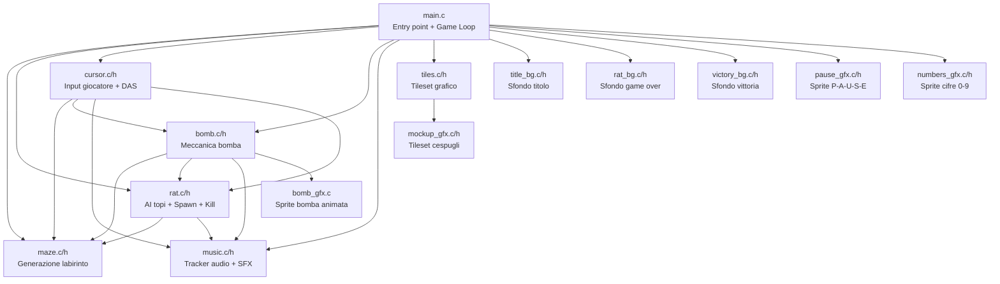

# Architettura dei Moduli

Il codice di MICE! è organizzato in moduli C indipendenti, ognuno responsabile di una singola area funzionale. Questa separazione è fondamentale su un sistema embedded dove la RAM è un bene rarissimo.

---

## Grafico delle Dipendenze



---

## Descrizione dei Moduli

### `main.c` — Collante e Loop Principale

**Responsabilità**: inizializzazione hardware, sequenza di schermate (titolo → gioco → vittoria/sconfitta), game loop principale.

Non contiene logica di gameplay propria: si limita a inizializzare i sotto-sistemi e richiamarli ogni frame nel corretto ordine.

```c
// Ordine di chiamata nel game loop
wait_vbl_done();      // Sincronizza con VBlank
update_music();       // Avanza il tracker audio
update_rats();        // AI + movimento + riproduzione
update_cursor();      // Input giocatore + armi
update_bombs();       // Stato bomba + esplosioni
```

---

### `maze.c/h` — Generazione Procedurale

Espone:
- `uint8_t maze[MAZE_HEIGHT][MAZE_PITCH]` — mappa globale in WRAM
- `void generate_maze(void)` — popola la mappa

Non ha dipendenze esterne. È il modulo più puro.

---

### `rat.c/h` — AI e Logica Topi

Espone:
- `void init_rats(void)` — inizializza i 4 topi di partenza
- `void update_rats(void)` — movimento, riproduzione, collisioni
- `void kill_rats_at(uint8_t x, uint8_t y)` — elimina topi su una cella
- `void spawn_rat(uint8_t x, uint8_t y, uint8_t dir)` — spawna un cucciolo

Dipende da `maze.c` (per il pathfinding) e `music.c` (per SFX nascita/morte).

---

### `cursor.c/h` — Input del Giocatore

Espone:
- `void init_cursor(void)` — carica il tile del cursore, posizione iniziale
- `void update_cursor(void)` — legge joypad, gestisce DAS, bomba, fucile, pausa audio

Dipende da `bomb.c`, `music.c`, `rat.c` (per il fucile).

---

### `bomb.c/h` — Meccanica Bomba

Espone:
- `void init_bombs(void)` — carica sprite bomba, nasconde tutto
- `void drop_bomb(uint8_t x, uint8_t y)` — attiva una bomba sulla cella
- `void update_bombs(void)` — avanza timer, gestisce esplosione propagante

Dipende da `maze.c` (per propagazione), `rat.c` (per kill), `music.c` (per SFX).

---

### `music.c/h` — Tracker Audio

Espone:
- `void init_music(void)` — configura registri APU, inizia la musica di gioco
- `void update_music(void)` — avanza il sequencer di un tick se necessario
- `void toggle_music(void)` — mute/unmute della musica di sottofondo
- `void play_sfx_*(void)` — effetti sonori istantanei (esplosione, fucile, ecc.)
- `void play_game_over_music(void)` / `play_victory_music(void)` / `play_title_music(void)`

Non dipende da nessun altro modulo di gioco.

---

### Moduli Asset (Sola Lettura)

Tutti questi moduli espongono esclusivamente **array `const`** in ROM, generati da script Python offline.

| Modulo | Contenuto | Dimensione tipica |
|--------|-----------|------------------|
| `tiles.c/h` | 22 tile 8×8: pavimenti + 16 varianti autotile cespugli | ~352 byte |
| `title_bg.c/h` | Tileset + mappa 20×18 dello sfondo titolo | ~8 KB |
| `rat_bg.c/h` | Tileset + mappa 20×18 dello sfondo game over | ~8 KB |
| `victory_bg.c/h` | Tileset + mappa 20×18 dello sfondo vittoria | ~8 KB |
| `pause_gfx.c/h` | 5 tile per le lettere P-A-U-S-E | ~80 byte |
| `numbers_gfx.c/h` | 10 tile per le cifre 0–9 | ~160 byte |
| `bomb_gfx.c` | Sprite bomba (3 fasi ticking + centro esplosione + fiamme) | ~176 byte |
| `mockup_gfx.c/h` | Tileset alternativo cespugli | ~varia |

---

## Mappa della VRAM Sprite (Tile Indices)

```
Indice  Contenuto
─────────────────────────────────────────────────────
  0     Topo: metà destra vista SINISTRA/DESTRA
  1     Topo: metà sinistra vista SINISTRA/DESTRA
  2     Topo: metà superiore vista SU/GIÙ
  3     Topo: metà inferiore vista SU/GIÙ
  4     Cursore (bordo quadrato lampeggiante)
  5     Bomba frame 3 (spenta)
  6     Bomba frame 2 (miccia lenta)
  7     Bomba frame 1 (miccia veloce, lampeggia)
  8     Centro esplosione (stella)
  9     Fiamma orizzontale (braccio est/ovest)
 10     Fiamma verticale (braccio nord/sud)
 11     Lettera P (PAUSE)
 12     Lettera A
 13     Lettera U
 14     Lettera S
 15     Lettera E
 16–24  (non usati o riservati)
 25–34  Cifre 0–9 (timer HUD)
```

---

## Mappa dell'OAM (Sprite Hardware Indices)

```
Slot    Uso
──────────────────────────────────────────────────────
 0–1    Topo 0 (metà sinistra, metà destra)
 2–3    Topo 1
 4–5    Topo 2
 6–7    Topo 3
 8–9    Topo 4
10–11   Topo 5
12–13   Topo 6
14–15   Topo 7
16–17   Topo 8
18–19   Topo 9
20–23   Pool esplosione bomba (gruppo A)
24      Flash sparo fucile
25–28   Timer HUD (4 cifre)
29–37   Pool esplosione bomba (gruppo B)
38      Sprite bomba principale (animato)
39      Cursore del giocatore
```
