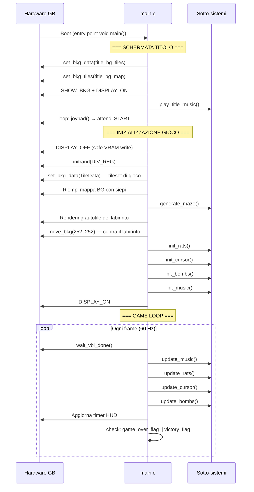

# Loop Principale e Inizializzazione

`src/main.c` è il punto di ingresso del programma. Contiene la sequenza completa di boot, l'inizializzazione di tutti i sotto-sistemi e il game loop principale.

---

## Sequenza di Avvio



---

## Seme Casuale da `DIV_REG`

```c
// src/main.c, riga 65
initrand(DIV_REG);
```

Il registro `DIV_REG` (`0xFF04`) è un timer hardware che si incrementa a ~16384 Hz indipendentemente dalla CPU. Il tempo esatto tra il boot e la pressione del tasto START da parte del giocatore è imprevedibile, rendendo il valore di `DIV_REG` un ottimo seme entropico per il generatore di numeri pseudo-casuali.

!!! tip "Perché DIV_REG e non una costante?"
    Se il seme fosse fisso, ogni partita genererebbe **esattamente lo stesso labirinto**.
    `DIV_REG` garantisce che ogni run produca un labirinto diverso.

---

## Caricamento VRAM in Sicurezza (DISPLAY_OFF)

```c
// src/main.c
DISPLAY_OFF;                              // Disattiva PPU → VRAM scrivibile in qualsiasi momento
set_bkg_data(0, 22, TileData);           // Carica tileset di gioco
// ... setup sprite data ...
generate_maze();
// ... rendering del labirinto nella mappa BG ...
DISPLAY_ON;
```

La VRAM è accessibile **solo durante HBlank o VBlank** quando il display è acceso. Disattivare la PPU prima di caricare grandi blocchi di dati è il metodo più sicuro per evitare glitch visivi durante l'inizializzazione.

---

## Rendering Autotile del Labirinto

Dopo la generazione, ogni cella del labirinto viene tradotta in un indice tile in base ai suoi vicini:

```c
// src/main.c, righe 94-112
for (y = 0; y < MAZE_HEIGHT; y++) {
    for (x = 0; x < MAZE_WIDTH; x++) {
        uint8_t tile_idx = maze[y][x];

        if (tile_idx == 1) { // Muro: calcola autotile
            uint8_t mask = 0;
            if (y > 0            && maze[y-1][x] == 1) mask |= 8; // Nord
            if (x < MAZE_WIDTH-1 && maze[y][x+1] == 1) mask |= 4; // Est
            if (y < MAZE_HEIGHT-1&& maze[y+1][x] == 1) mask |= 2; // Sud
            if (x > 0            && maze[y][x-1] == 1) mask |= 1; // Ovest
            tile_idx = 6 + mask; // tile 6-21: 16 varianti di cespuglio
        } else {
            // Percorso: variante di pavimento casuale
            uint8_t r = rand() % 10;
            if (r < 5) tile_idx = 0;       // Pavimento liscio (più comune)
            else tile_idx = 1 + (r % 5);   // Variante decorata
        }
        set_bkg_tiles(x, y, 1, 1, &tile_idx);
    }
}
```

Questo si traduce in 16 varianti di cespuglio (angolo, bordo N/S/E/O, T-junction, croce, ecc.) che si connettono visivamente in modo coerente.

---

## Centratura con Hardware Scrolling

La mappa del Background hardware è `32×32 tile` (256×256 px), ma il labirinto è `19×17 tile` (152×136 px). Per centrarlo nella finestra di 160×144:

```c
// src/main.c, riga 115
move_bkg(252, 252);
```

`252 = 256 - 4`, dove 4 è il margine di 4 pixel a sinistra. Questo sfrutta il wrap-around modulare della mappa hardware: lo scroll a `(252, 252)` equivale a iniziare la visualizzazione dal pixel `(-4, -4)` del tilemap, centrando il labirinto con un bordo di 4 px su tutti i lati.

---

## Game Loop e Transizione agli Stati Finali

```c
// src/main.c, game loop
while (1) {
    wait_vbl_done();        // (1) Sync VBlank — punto sicuro per VRAM
    update_music();         // (2) Audio — priorità alta per continuità sonora
    update_rats();          // (3) AI — logica + sprite
    update_cursor();        // (4) Input + armi
    update_bombs();         // (5) Esplosioni

    // Aggiornamento HUD timer...

    if (game_over_flag || victory_flag) {
        HIDE_SPRITES;       // Nasconde tutti gli sprite
        move_bkg(0, 0);     // Azzera lo scrolling hardware

        // Carica lo sfondo dedicato in VRAM
        if (victory_flag) {
            set_bkg_data(0, 256, victory_bg_tiles);
            set_bkg_tiles(0, 0, 20, 18, victory_bg_map);
            play_victory_music();
        } else {
            set_bkg_data(0, 256, rat_bg_tiles);
            set_bkg_tiles(0, 0, 20, 18, rat_bg_map);
            play_game_over_music();
        }

        SHOW_SPRITES;
        while(1) {          // Loop finale — solo audio e punteggio
            update_music();
            wait_vbl_done();
        }
    }
}
```

!!! note "Perché HIDE_SPRITES prima di caricare la VRAM?"
    Quando si carica `set_bkg_data(0, 256, ...)` si sovrascrivono **tutti** i tile in VRAM,
    compresi quelli usati dagli sprite. Se la PPU stesse ancora disegnando gli sprite in quel
    momento, vedremmo un singolo frame di glitch grafico. `HIDE_SPRITES` sposta tutti gli sprite
    a coordinate `(0,0)` atomicamente prima del caricamento.

---

## Timer HUD con Aritmetica BCD

Il timer usa un array di 4 cifre decimali invece di un singolo intero a 16-bit, evitando la divisione hardware:

```c
// src/main.c
uint8_t timer_digits[4] = {0, 0, 0, 0}; // Rappresenta "0000"
uint8_t timer_frames = 0;

// Ogni 60 frame (1 secondo), incrementa con carry BCD manuale
timer_frames++;
if (timer_frames >= 60) {
    timer_frames = 0;
    timer_digits[3]++;           // Unità secondi
    if (timer_digits[3] >= 10) { timer_digits[3] = 0; timer_digits[2]++; }
    if (timer_digits[2] >= 6)  { timer_digits[2] = 0; timer_digits[1]++; } // Decine secondi
    if (timer_digits[1] >= 10) { timer_digits[1] = 0; timer_digits[0]++; } // Minuti
}

// Render: ogni cifra usa un tile sprite (indice 25+digit)
set_sprite_tile(25, 25 + timer_digits[0]);
set_sprite_tile(26, 25 + timer_digits[1]);
set_sprite_tile(27, 25 + timer_digits[2]);
set_sprite_tile(28, 25 + timer_digits[3]);
```

Questa tecnica è identica a quella usata nei computer degli anni '80 per i contatori di punteggio, ed elimina completamente le divisioni a 16 bit che sarebbero necessarie per estrarre le singole cifre da un intero.
