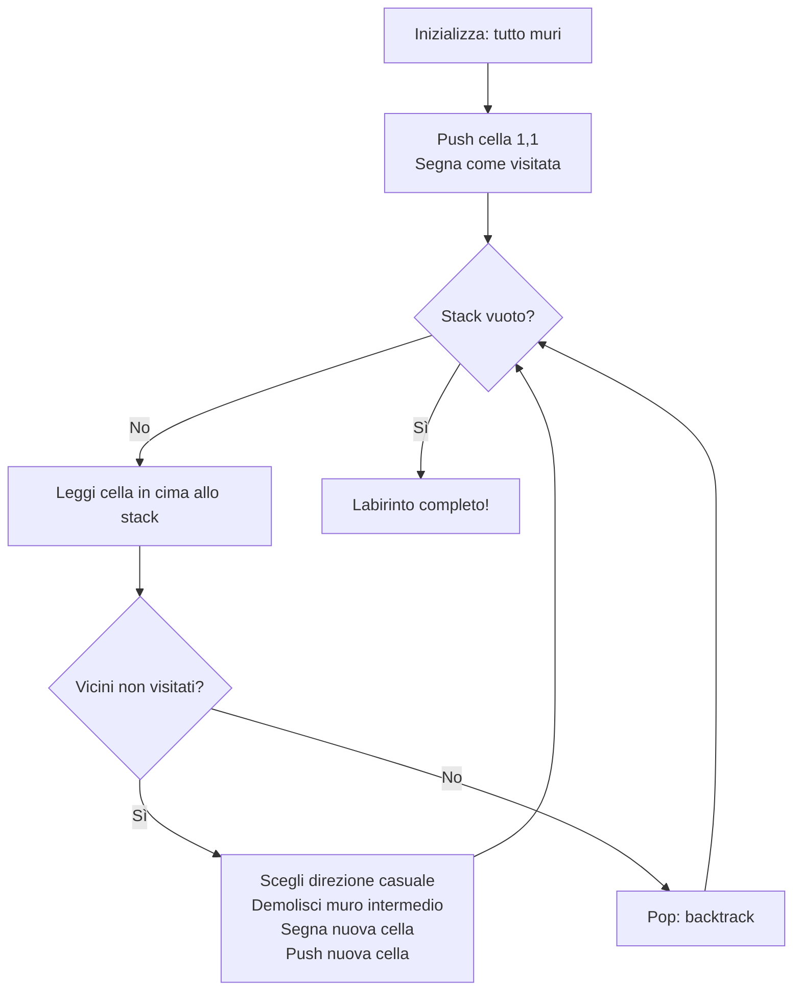

# Generazione Procedurale del Labirinto

**File**: `src/maze.c`, `src/maze.h`

Il labirinto è generato ogni volta che si avvia una partita usando l'algoritmo **Recursive Backtracker** (noto anche come DFS su griglia), implementato in versione **iterativa** per evitare di esaurire lo stack hardware del Game Boy.

---

## Struttura Dati

```c
// src/maze.h
#define MAZE_WIDTH  19   // Larghezza logica (celle dispari per simmetria)
#define MAZE_HEIGHT 17   // Altezza logica
#define MAZE_PITCH  32   // Larghezza allocata (potenza di 2 — ottimizzazione critica)

extern uint8_t maze[MAZE_HEIGHT][MAZE_PITCH];
```

La matrice è allocata in **WRAM** (Work RAM), uno dei beni più preziosi del Game Boy. Con `MAZE_PITCH = 32`, occupa `17 × 32 = 544 byte` su un totale di 8192 byte disponibili.

### Perché MAZE_PITCH = 32 e non 19?

L'accesso a `maze[y][x]` viene compilato da SDCC come:

```
address = base_address + (y * MAZE_PITCH) + x
```

Con `MAZE_PITCH = 19`, SDCC emette una subroutine di moltiplicazione software (~20 cicli). Con `MAZE_PITCH = 32` (potenza di 2), la moltiplicazione diventa un **bit-shift**:

```asm
; y * 32 = y << 5
; Generato da SDCC con MAZE_PITCH = 32:
LD A, y_reg
ADD A, A    ; ×2
ADD A, A    ; ×4
ADD A, A    ; ×8
ADD A, A    ; ×16
ADD A, A    ; ×32  ← 5 istruzioni, ~5 cicli
```

I 13 byte "sprecati" per riga valgono ampiamente il risparmio in cicli CPU su ogni accesso.

---

## L'Algoritmo: Recursive Backtracker

L'algoritmo scava i percorsi del labirinto partendo da una cella iniziale ed espandendosi in modo pseudo-casuale, tornando sui propri passi quando si trova in un vicolo cieco.

### Garanzie dell'algoritmo

1. **Labirinto perfetto**: ogni cella è raggiungibile da ogni altra tramite un unico percorso (albero di copertura).
2. **Nessun ciclo**: non esistono percorsi circolari.
3. **Nessuna isola**: non esistono sezioni disconnesse.

### Implementazione Iterativa

```c
// src/maze.c — stack customizzato in WRAM
uint8_t stack_x[100];
uint8_t stack_y[100];
uint8_t stack_ptr = 0;
```

!!! warning "Perché non la ricorsione?"
    La versione ricorsiva di questo algoritmo richiede uno stack frame per ogni cella visitata.
    Per un labirinto 19×17 = 323 celle, lo stack potrebbe crescere di **300+ livelli**.
    Lo stack del Game Boy è in HRAM (127 byte) o WRAM, ed è condiviso con GBDK.
    Una ricorsione profonda causerebbe uno **stack overflow** e un crash immediato.

### Codice Completo

```c
// src/maze.c
void generate_maze(void) {
    uint8_t x, y, nx, ny;
    uint8_t dirs[4];
    uint8_t count, r;

    // Fase 1: Riempi tutto con muri
    for (y = 0; y < MAZE_HEIGHT; y++)
        for (x = 0; x < MAZE_WIDTH; x++)
            maze[y][x] = 1;

    // Fase 2: Cella iniziale in (1,1)
    stack_ptr = 0;
    push(1, 1);
    maze[1][1] = 0;

    // Fase 3: DFS iterativo
    while (stack_ptr > 0) {
        x = stack_x[stack_ptr - 1];
        y = stack_y[stack_ptr - 1];

        // Cerca vicini non visitati a distanza 2
        count = 0;
        if (x >= 2            && maze[y][x-2] == 1) dirs[count++] = 0; // Sinistra
        if (x <= MAZE_WIDTH-3 && maze[y][x+2] == 1) dirs[count++] = 1; // Destra
        if (y >= 2            && maze[y-2][x] == 1) dirs[count++] = 2; // Su
        if (y <= MAZE_HEIGHT-3&& maze[y+2][x] == 1) dirs[count++] = 3; // Giù

        if (count > 0) {
            r = rand() & 3;         // ← & invece di %, vedi Ottimizzazioni
            while (r >= count) r = rand() & 3;

            nx = x; ny = y;
            if      (dirs[r] == 0) { nx -= 2; maze[y][x-1] = 0; } // Sinistra
            else if (dirs[r] == 1) { nx += 2; maze[y][x+1] = 0; } // Destra
            else if (dirs[r] == 2) { ny -= 2; maze[y-1][x] = 0; } // Su
            else if (dirs[r] == 3) { ny += 2; maze[y+1][x] = 0; } // Giù

            maze[ny][nx] = 0;
            push(nx, ny);
        } else {
            pop(&x, &y); // Backtrack
        }
    }
}
```

---

## Visualizzazione dell'Algoritmo



---

## Convenzione Celle

```
1 = Muro (blocco di siepe)
0 = Percorso (camminabile)
```

Il labirinto usa coordinate con **indici dispari** per le celle percorribili e **indici pari** per i muri:

```
(1,1) (1,3) (1,5) ...   ← Celle percorribili
(1,2)                   ← Muro tra (1,1) e (1,3) — può essere abbattuto
(0,*)                   ← Sempre muro (bordo)
```

Questo garantisce che il bordo esterno (riga 0, colonna 0, ultima riga, ultima colonna) sia sempre un muro solido.

---

## Entropía: `initrand(DIV_REG)`

```c
initrand(DIV_REG); // Seme dal timer hardware
```

Il registro `DIV_REG` (0xFF04) si incrementa a ~16384 Hz, indipendentemente dalla CPU. Il tempo tra il boot e la pressione di START da parte del giocatore è imprevedibile, garantendo un seme diverso ad ogni partita e quindi un labirinto sempre unico.
